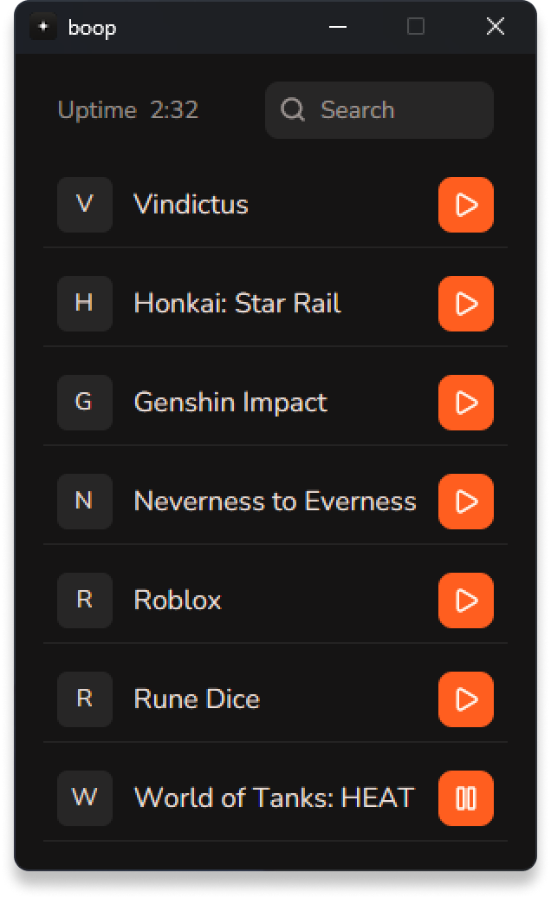

  <h1>boop</h1>
  
a hub for completing Discord quests

[![CI][header-ci-badge]][ci]
&nbsp;[![Latest release][header-release-badge]][releases]
&nbsp;![Platform][header-platform-badge]
&nbsp;[![GitHub License][header-repo-license-badge]][repo-license]

  

## what it is

boop is a small GUI hub that launches lightweight **stub** windows mimicking
games. Discord's quest detection sees the stub as the real game running, so you
can clear "play a game" quests without installing or running the actual title.
apps are defined in a plain `config.toml` — pick one, hit play, done.

## how it works

- each entry in `config.toml` maps a Discord-recognised game to an executable path.
- hitting **play** drops a tiny stub executable at that path (if it isn't there
  yet) and runs it.
- the stub opens a real but off-screen top-level window — enough for Discord's
  process + window detection to register the game as "running".
- hitting **pause** kills it. closing boop kills everything it launched (a job
  object guarantees nothing outlives the hub).

## usage

1. grab the latest `boop-*-windows-x64.zip` from [releases][releases] and unzip
   it — keep `boop.exe` and `stub.exe` together in the same folder.
2. run `boop.exe` once; it writes a default `config.toml` next to the exe.
3. edit `config.toml` to taste and launch entries from the hub. changes
   hot-reload, no restart needed.

## disclaimer

This software is provided "as is", without warranty of any kind. You use it
entirely at your own risk. The authors are not responsible for any damage, data
loss, account suspensions, bans, or any other consequences arising from its use.

Using boop to complete Discord quests may violate Discord's Terms of Service and
can lead to account action up to and including a permanent ban. By using it, you
accept these terms and assume all risk.

## cat in the readme

    

## license

boop is licensed under the [zlib/libpng license][repo-license].

## acknowledgements

boop builds on third-party work — gpui (Zed Industries), the Nunito font, and
Lucide icons among others. full notices and license texts live in
[ACKNOWLEDGEMENTS](../ACKNOWLEDGEMENTS).

<!-- link references -->
[ci]: https://github.com/whiskydumb/boop/actions/workflows/ci.yml
[header-ci-badge]: https://github.com/whiskydumb/boop/actions/workflows/ci.yml/badge.svg
[releases]: https://github.com/whiskydumb/boop/releases/latest
[header-release-badge]: https://img.shields.io/github/v/release/whiskydumb/boop?style=flat-square
[header-platform-badge]: https://img.shields.io/badge/platform-windows-blue?style=flat-square
[header-repo-license-badge]: https://img.shields.io/github/license/whiskydumb/boop?style=flat-square
[repo-license]: https://github.com/whiskydumb/boop/blob/HEAD/LICENSE
